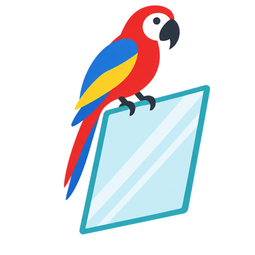
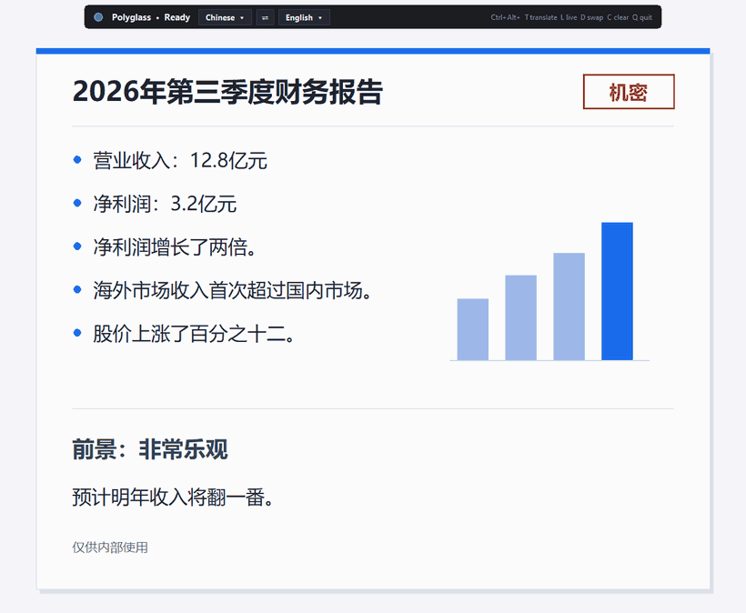

<p align="center">
  
</p>

<h1 align="center">Polyglass</h1>

<p align="center"><em>Any language</em></p>
<p align="center"><em>Any place</em></p>

<p align="center"><a href="https://github.com/APierce-Ptak/polyglass/actions/workflows/tests.yml"></a></p>

<p align="center">
  <a href="https://apierce-ptak.github.io/polyglass/"><strong>Website</strong></a> ·
  <a href="https://github.com/APierce-Ptak/polyglass/releases/latest/download/Polyglass.zip"><strong>Download for Windows</strong></a>
</p>

<p align="center">
  
</p>

A transparent, click-through overlay for Windows that reads the text on your screen and draws the translation, in the language you choose, **in the same spot**, right over the original. It works on games, videos, apps, and web pages.

- **Any language to any language.** Pick *From* and *To* in the bar at the top of the screen, like Google Translate, or leave *From* on *Detect language*. Installed languages show ✓; others show their download size (for example ⬇ 238 MB) and download when you pick them. The ⇄ button (or Ctrl+Alt+D) swaps them.
- Supports Chinese, Japanese, Korean, Russian, Arabic, and Latin-script languages (Spanish, French, German, and others). Between two non-English languages (for example Japanese → Spanish), it translates through English.
- **Private and fully local:** reading and translating both run on your PC, and nothing is uploaded. No accounts, API keys or subscriptions.
- **Works on anything on your screen:** games, videos, PDFs, apps, web pages, remote desktops. No plugins or integrations.
- **Plug and play:** internet is only needed once, for setup (and later only to add a language).
- Live mode re-translates only when the text on screen actually changes, so it doesn't waste CPU.
- Always-on bar at the top of the screen with the language pickers and a loading spinner while it works.
- Click-through: you keep using your game or app normally.

## Install

1. Download **[Polyglass.zip](https://github.com/APierce-Ptak/polyglass/releases/latest/download/Polyglass.zip)** from the latest release and unzip it.
2. Double-click **`Install.bat`**.
3. Follow the setup wizard. Choose *Translate from* (or *Detect language*) and *Translate to*, with a ⇄ button to swap them. The wizard creates a private Python environment, installs the packages, adds Windows OCR language packs, downloads the offline translation models, and makes a desktop shortcut.

Requirements: Windows 10 or 11, an internet connection for setup, and about 450 MB of free disk space plus your languages (usually 150-400 MB each; setup and the language bar show the exact size before downloading). If Python 3.10-3.12 is missing, `Install.bat` installs it with [winget](https://github.com/microsoft/winget-cli) or sends you to the download page.

## Use

Start **Polyglass** from the desktop shortcut (or `Run.bat`), click the window with the text, and press:

| Hotkey | Action |
|---|---|
| Ctrl+Alt+T | Translate the screen once |
| Ctrl+Alt+L | Turn live mode on or off |
| Ctrl+Alt+D | Swap the From and To languages |
| Ctrl+Alt+C | Clear the overlay |
| Ctrl+Alt+Q | Quit |

Click the languages in the bar to change them. With a *From* language picked, the screen is read as that language; with *Detect language*, it works out the language itself and leaves text that is already in the output language alone.

To use a screen other than the main one, add `"monitor": 2` (or 3, ...) to `polyglass.json` in the app folder.

The first translation after each launch takes several seconds while the models load. After that it takes 1-3 seconds.

Games should run in **windowed or borderless** mode. Exclusive fullscreen draws above any overlay.

## How it works

1. `mss` captures the screen.
2. [RapidOCR](https://github.com/RapidAI/RapidOCR) reads Chinese and Japanese text, including stylised game fonts. Windows' built-in OCR handles other languages, with automatic language detection.
3. [Argos Translate](https://github.com/argosopentech/argos-translate) translates each line offline into the current output language. When there's no direct model, it goes through English (for example Japanese → English → Spanish).
4. A transparent, click-through Tk window paints each translation over its source line, with the background colour sampled from the screenshot. The window is hidden from screen capture so it never reads its own output.

## Troubleshooting

Run `Debug.bat` to see a console with what the app is doing. It prints the installed OCR languages, the text found, and what it draws. The shortcut writes the same information to `polyglass.log`.

- **Accents misread, or Korean/Russian/Arabic not read:** Windows is missing that language's text recognition. Click the blue *Add Windows text recognition* message in the bar (or re-run `Install.bat`) and accept the Windows permission prompt.
- **Nothing appears over a game:** switch the game to windowed or borderless.
- **Ctrl+Alt+D won't swap:** *From* is set to *Detect language*, so there's nothing to swap with. Click *From* in the bar and pick a language.
- **Wrong or odd translations:** offline models are good but not perfect. Text is translated line by line.

## Manual install

```
py -3.12 -m venv .venv
.venv\Scripts\python -m pip install -r requirements.txt
.venv\Scripts\python -m pip install --no-deps argostranslate==1.11.0
.venv\Scripts\python polyglass.py
```

## Uninstall

Double-click **`Uninstall.bat`**. It shows what it will remove and how much space that frees, then asks before removing anything:

- the app's packages (`.venv` in the app folder, about 450 MB)
- the translation models in `%USERPROFILE%\.local\share\argos-translate` and their download cache in `%USERPROFILE%\.local\cache\argos-translate`. These are outside the app folder, and are shared with other Argos Translate apps if you have any.
- the desktop shortcut, your settings and the logs

It also offers to remove the Windows text-recognition packs that `Install.bat` added (not ones you already had). This needs admin permission.

When it's done, delete the app folder. If `Install.bat` installed Python 3.12 for you, you can remove it in **Settings → Apps** if nothing else uses it. Polyglass makes no other changes: no registry entries, startup items or services.

## Development

Tests run automatically on GitHub for every push (on a fresh Windows machine). To run them from the app folder:

```
.venv\Scripts\python -m unittest -v
```

Releases are listed in [CHANGELOG.md](CHANGELOG.md).

## License

MIT
